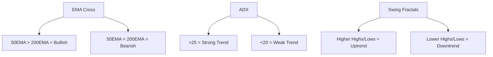

# 📊 CryptoDataAnalyzer

**CryptoDataAnalyzer** is an advanced crypto analytics tool that uses multi-timeframe price action, EMA, ADX, swing high/low patterns, and psychological/Fibonacci levels to detect optimized support/resistance zones and overall market trend direction. Designed for data-driven traders and analysts.

> ✅ Language: Turkish Interface & Commentary  
> ✅ Ideal for scalping, swing trading, and long-term position analysis

---

## 🧠 Overview

The tool utilizes a three-tiered trend detection system (EMA, ADX, Swing Analysis) and dynamically identifies support/resistance levels using:
- Historical major/minor swing points
- Fibonacci retracements
- EMA levels (50/200)
- Psychological price levels

**Trend Detection System:**
- **📈 Yükseliş (Uptrend)**: All indicators suggest bullish movement
- **🔻 Düşüş (Downtrend)**: Strong bearish consensus across indicators
- **🔄 Yatay (Sideways)**: Inconclusive trend; price consolidation likely
- **❓ Belirsiz (Uncertain)**: Weak or noisy signal, further confirmation needed

---

## ⚙️ Features

- ✅ **Multi-Timeframe Support/Resistance Detection** (1H, 4H, 1D, 1W)
- ✅ **EMA (50 / 200)** Dynamic Levels per timeframe
- ✅ **ADX + Swing High/Low + EMA Combo Trend Detection**
- ✅ **Fibonacci retracement overlays**
- ✅ **Psychological level mapping**
- ✅ **Auto-prioritization of support/resistance levels**
- ✅ **Custom visual chart rendering (matplotlib)**
- ✅ **Adaptive strategy selection based on timeframe**
- ✅ **Turkish analysis output with color-coded signal guidance**

---
## 🔍 Analysis Methodology

### 📊 Multi-Factor Convergence System
This tool employs a weighted scoring algorithm that synthesizes data from:

#### 1. Trend Detection Layer

---

## 🖼️ Visual Output

- 📌 Support & resistance lines (color-coded by priority)
- 📊 EMA levels drawn with explanation
- 🧠 Trend summary box with indicator details
- 📉 Volume bars with dynamic price scaling
- 🔺 Fibonacci levels drawn as dashed or solid lines

---

## 🧰 Technologies Used

| Tech              | Purpose                        |
|------------------|--------------------------------|
| Python           | Core programming language      |
| Pandas / NumPy   | Data wrangling & computation   |
| Matplotlib       | Financial chart visualization  |
| Binance API      | Real-time and historical data  |
| Scipy / Stats    | Swing point & statistical calc |
| TkAgg / Agg      | Flexible matplotlib backend    |

---

## 🚀 Usage

```bash
# 1. Clone the repo
git clone https://github.com/your-username/CryptoDataAnalyzer.git

# 2. Install requirements
pip install -r requirements.txt

# 3. Create a .env file and add your Binance credentials
API_KEY=your_api_key_here
API_SECRET=your_secret_key_here

# 4. Run the tool
python Kripto5.1.py
```

## 🖥️ Preview
### 🔍Crypto and Timeframe Selection Panel


### 🤖 Strategy Analysis Results
### ⏳ Hour (Scalping Framework)

* Micro-structure visualization
* High-precision level marking

### 🕓 4 Hour (Swing Dashboard)

* Intermediate-term trend channels
* Volume-profile integrated zones

### 🌞 Daily (Position Trader View)

* Macro structure mapping
* Institutional-level pivots

### 📅 Weekly (Strategic Vision)

* Multi-year reference levels
* Cyclical pattern analysis

## ⚠️ Legal Disclaimer

**Important Notice Regarding Financial Analysis:**
- This software and its outputs constitute **technical analysis only** and shall not be interpreted as investment advice.
- All market analysis, indicators, and signals are provided for **educational/research purposes** exclusively.
- Cryptocurrency trading involves substantial risk of loss and is not suitable for all investors.
- Past performance is **not indicative** of future results.
- The developer assumes **no liability** for trading decisions made using this tool.

**Regulatory Compliance:**
- This project does not hold any financial advisory licenses
- No guarantee is made regarding the accuracy of analysis outputs
- Users assume full responsibility for their trading actions

**Recommended Disclosure Text** (Add to your UI/README):
> "The analytical outputs generated by this software are for informational purposes only and should not be construed as investment advice or recommendation to buy/sell any financial instrument. Always conduct your own due diligence and consult licensed financial advisors before making trading decisions."

## 👨‍💻 Developer

**Ömer Faruk Karaköy**    
🌐 GitHub: [github.com/OmerFarukKarakoy](https://github.com/OmerFarukKarakoy)  
📧 Mail: omerfarukkarakoy@gmail.com

---

